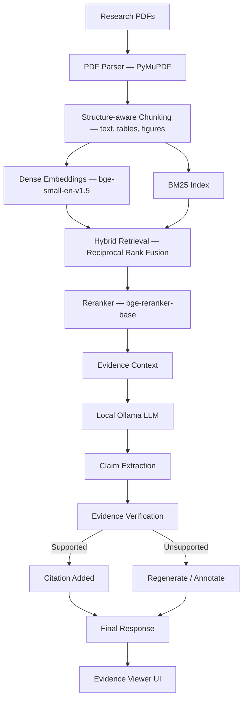
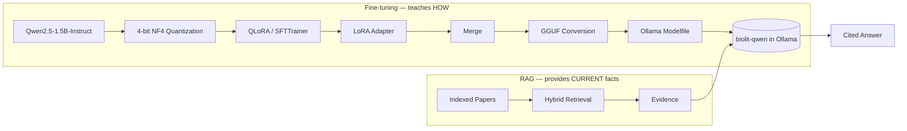

# BioLit — Evidence-Grounded Scientific Literature Synthesis

A **local, privacy-preserving** research assistant for biomedical / drug-discovery literature. Every model — embeddings, reranker, generator, verifier — runs on your machine through [Ollama](https://ollama.com) and local Hugging Face models. No document, query, or answer ever leaves the machine. There is no OpenAI/Anthropic/Gemini call anywhere in this codebase.

BioLit is not a chatbot. It is a hybrid-retrieval RAG pipeline with structure-aware chunking (text, tables and figures), claim-level citation verification, and an evaluation framework that measures — rather than assumes — whether any of that actually helps. A QLoRA fine-tuning experiment is included too, reported as an evaluated side study that the app does not use ([§18](#18-experiment-qlora-fine-tuning-evaluated-not-deployed)).

---

## Status and results at a glance

**Works today (verified):** an end-to-end local pipeline over **50 arXiv papers** (1,484 indexed chunks: text, tables and figure captions) — ingest, hybrid retrieval, rerank, cited answer, claim verification, React UI. `GET /api/health` reports `ok`, and the test suite passes (166 tests, 4 skipped; 146 of them need no models and run in CI). A smoke test exercises every endpoint against the running backend and validates the responses. The app serves `qwen2.5:3b` through Ollama.

**Retrieval and answer quality, measured on the 50-paper corpus** (144 labelled questions; full method, intervals and caveats in [§9.1](#91-retrieval-and-answer-quality-50-papers)):

| | Recall@5 | MRR |
|---|---|---|
| BM25 | 0.76 | 0.62 |
| Dense only | 0.57 | 0.44 |
| Hybrid (rank fusion) | 0.76 | 0.59 |
| **Hybrid + reranker (Balanced mode)** | **0.83** | **0.65** |

The reranker is best overall and on tables (0.87), figures (0.81) and hard questions, but its overall edge over BM25 is within the confidence intervals. Answer quality was scored with RAGAS and a local 3B judge, and each metric was checked against deliberately wrong inputs: context precision (0.71) and factual correctness (0.21) passed, faithfulness passed but scored harshly (0.28 with the stock judge, 0.39 on the same answers with a calibrated judge, [§9.2](#92-a-less-harsh-judge-and-a-prompt-change-that-did-not-move-the-scores)), and answer relevancy and context recall did not, so they are marked unreliable rather than trusted.

**Fine-tuning** was also tried and is kept as an evaluated experiment, not a part of the served app: QLoRA taught a 1.5B model to cite (0 → 14 of 14 held-out prompts), but a better prompt on the served `qwen2.5:3b` did about as well with no training, so nothing fine-tuned is deployed ([§18](#18-experiment-qlora-fine-tuning-evaluated-not-deployed)).

---

## 1. Project overview

Given a folder of biomedical PDFs, BioLit:

1. Parses them into page- and section-aware chunks (PyMuPDF), with tables kept as Markdown grids and figures as captioned crops.
2. Indexes those chunks with both dense embeddings (FAISS) and lexical search (BM25).
3. Retrieves and reranks evidence for a research question in one of three configurable modes (Fast / Balanced / High-Faithfulness).
4. Generates an answer through a local Ollama model, with every factual sentence numbered against its source evidence.
5. Extracts the claims the model made, re-checks each one against its cited evidence with a second LLM pass, and labels it `SUPPORTED` / `PARTIALLY_SUPPORTED` / `UNSUPPORTED` / `CONTRADICTED`.
6. Surfaces all of this — answer, citations, evidence text, page numbers, verification status, latency — in a React evidence-viewer UI.
7. Includes a QLoRA fine-tuning experiment (training, evaluation and export code, all tested). It is an evaluated side study, not part of the served pipeline: see [§18](#18-experiment-qlora-fine-tuning-evaluated-not-deployed).

## 2. Motivation

Generic chatbots over PDFs tend to (a) blend retrieval and generation into one opaque step, (b) trust the model's own citations, and (c) have no way to tell you whether a claim is actually supported. For biomedical literature — where a wrong "32% reduction in tumor growth" is not a cosmetic bug — that's not good enough. BioLit keeps retrieval, generation, and verification as separate, inspectable stages, and reports honestly when something wasn't checked or couldn't be confirmed.

## 3. Architecture



## 4. Why RAG?

Facts belong in the index, not the weights. RAG is what lets BioLit answer questions about papers added five minutes ago, cite a specific page, and be updated by dropping in a new PDF — none of which fine-tuning alone can do.

## 5. Why Ollama?

Ollama is the only LLM inference path in this application. It keeps the served model, the runtime, and all inference fully local and swappable (GGUF in, `ollama create`, done) without the app depending on any cloud provider's API or uptime.

## 6. Repository layout

```
BioLit/
├── backend/            FastAPI app: ingestion, retrieval, generation, verification, evaluation
├── frontend/            React + TypeScript + plain CSS UI (no Tailwind, no component libs)
├── training/             QLoRA experiment: dataset build / train / evaluate / export (LoRA -> GGUF -> Ollama), see §18
├── data/                 raw PDFs, processed papers, figure crops, train/val/test splits, indexes, results (gitignored)
├── models/               LoRA adapters, merged model, GGUF export (gitignored)
├── experiments/          evaluation results (citation-study and eval/ JSONs are committed; raw run files and the rest are gitignored)
├── scripts/              CLI entry points (see §12)
├── configs/               models.yaml, retrieval.yaml, training.yaml — the only place to change models/params
├── .github/workflows/     CI: model-free tests + frontend typecheck/build
└── tests/                 cross-cutting + integration tests (per-package tests live under backend/tests)
```

## 7. Retrieval pipeline

- **Chunking**: structure-aware and page-aware. Text is cut at section headings (Abstract/Introduction/Methods/Results/Discussion/Limitations/Conclusion/References) and packed on sentence boundaries with configurable size and overlap (`configs/retrieval.yaml`). Tables and figures are pulled out of the running text first (`backend/app/ingestion/structure.py`), because flattening a results table into a run of numbers gives chunks that are neither readable nor retrievable:
  - **Tables** become their own chunks: the caption plus a Markdown grid (`| Method | AUC |` …). Ruled tables come from PyMuPDF's line detection; "booktabs"-style tables with no vertical rules are read from text alignment, anchored on the caption and limited to its column. A table that fails a sanity check (cells that look like prose, mostly empty) is left in the body text instead. Long tables are split by rows with the caption and header repeated in every part.
  - **Figures** become caption chunks with a PNG crop of the graphics above the caption (embedded images and vector drawings alike), saved under `data/figures/` and shown in the evidence viewer. Any text inside the figure (axis labels, legends) is kept with the caption. Only the caption is embedded: nothing in this stack reads pixels, so a figure is found by what its caption says.
  - This is structural, not semantic, chunking. It is best-effort on real PDFs: in a few two-column layouts a table's words can split across cells. Across the 50-paper corpus it produced 1,562 text, 112 table and 215 figure chunks (`scripts/ingest.py` prints the counts).
- **Dense**: `BAAI/bge-small-en-v1.5` embeddings in a FAISS flat inner-product (cosine) index.
- **Lexical**: BM25 (`rank_bm25`) over the same chunks.
- **Fusion**: Reciprocal Rank Fusion combines dense + BM25 rankings.
- **Reranking**: `BAAI/bge-reranker-base` cross-encoder re-scores the fused top candidates down to the final evidence set. It runs on the GPU in half precision when there is room and falls back to the CPU automatically if the card is full (the LLM shares the same 4 GB GPU); `GET /api/health` reports where it landed (`reranker_device`). Half precision picks the same top-5 evidence as full precision on 16 of 16 test queries.
- **Three modes** (`configs/retrieval.yaml` → `modes`), selectable per query in the UI:
  - **Fast** — dense retrieval only, no reranker, no verification. Lowest latency.
  - **Balanced** — hybrid (dense+BM25) retrieval + reranker, citations extracted but not LLM-verified (claims are shown as "Not verified").
  - **High-Faithfulness** — hybrid + reranker + lightweight query decomposition + full claim extraction, LLM-based verification, and regeneration of unsupported claims (or explicit "unsupported" annotation if regeneration still fails).

## 8. Citation verification

After generation, every factual statement is extracted as a claim and mapped to its `[n]` marker(s). The extractor deliberately ignores scaffolding that is not an assertion — headings, lead-ins ("The main findings are:"), bare citation markers, label-only lines, an uncited "the evidence does not specify X" caveat, and any echo of the regeneration prompt — and it keeps a citation with the sentence it belongs to even when the model places it after the period or on the next line. Each cited claim is independently re-checked against *only* its cited evidence by a second, low-temperature LLM pass and classified `SUPPORTED` / `PARTIALLY_SUPPORTED` / `UNSUPPORTED` / `CONTRADICTED`. Claims with no citation are never assumed supported.

If a generated answer contains no valid `[n]` marker at all, the pipeline asks once more with a reminder and keeps the retry only if it actually cites (`citation_retry` in `configs/retrieval.yaml`). An answer that merely says the evidence is insufficient is left alone. In a small test on questions that had failed to cite (3 questions × 8 runs), answers with no citation dropped from 2 of 24 to 0 of 24, at the cost of roughly +10 s on the questions where it triggered.

In High-Faithfulness mode an unsupported answer is regenerated, but a revision is kept only if it retains its citations and lowers the unsupported rate; otherwise the original answer is kept, with its unverified claims annotated. (A small model often "revises" by dropping every `[n]`, which would leave the answer unverifiable.)

The verifier itself was checked on controlled cases and got 12 of 12 right: verbatim sentences came back `SUPPORTED`, and both invented claims and mis-cited claims came back `UNSUPPORTED`. In practice its rejections trace back to the generator — citing the wrong block, or citing nothing.

**Unverified modes.** Fast and Balanced do not verify, so their claims carry a `NOT_VERIFIED` status (a gray "Not verified" badge in the UI) and precision, faithfulness and the unsupported-claim rate are reported as *not measured* (shown as "—") instead of a misleading 0%. Only citation coverage, which needs no verifier, is reported for them. In High-Faithfulness mode every claim gets a real status.

**A fast "check source" flag for unverified modes.** `backend/app/verification/grounding.py` runs in milliseconds with no LLM: it looks at whether a claim cites anything, how much of its wording appears in the cited passages, whether every number in it appears there, and whether each cited block is related to it. Claims it scores as "none" get a dashed orange **Check source** badge, and the answer header shows a "Flagged to check" count. It is a hint, not a verdict, and it was measured before being shown. On 258 cited claims from 44 questions, compared with the LLM verifier's verdicts (`scripts/calibrate_grounding.py`, results in `experiments/grounding_calibration.json`):

| | Calibration half | Held-out half | Both |
|---|---|---|---|
| Flagged claims that the verifier called unsupported or contradicted | 47% (14/30) | 68% (17/25) | 56% (31/55) |
| Unsupported or contradicted claims that were flagged | 35% | 49% | 41% (31/75) |

A random flag would be right 29% of the time (75 of the 258 claims), so the flag roughly doubles the hit rate while still missing more than half of the bad claims. The thresholds were fixed before the data was collected. The other two labels, "strong" and "weak", were not good enough to show: "strong" matched the verifier's `SUPPORTED` only 56% of the time on the held-out half (base rate 42%), and the per-answer share of strong claims was off by about 0.30 on average. That is why no "estimated faithfulness" number is reported, and why the flag does not replace High-Faithfulness mode. The reference is itself a 3B model's judgement, not ground truth, and the two halves differ noticeably, so the figures are rough.

Citation Precision, Citation Coverage and Faithfulness are computed in `backend/app/verification/citation_validator.py`.

## 9. Evaluation

### Methodology
- **Retrieval and answer quality on a labelled set** — see [§9.1](#91-retrieval-and-answer-quality-50-papers) below.
- **Citation behaviour of the fine-tuned adapters vs prompting** — the fine-tuning experiment's results are in [§18.4](#184-results-of-the-citation-study).
- **Latency** per RAG mode: `scripts/benchmark.py`. It has not been run against the final pipeline, so no latency figures are reported here. For orientation, single answers from the served model took roughly 4–20 s in Fast/Balanced mode (longer for summaries and comparisons) and 15–60 s in High-Faithfulness mode on the development laptop (RTX 3050, 4 GB).

### 9.1 Retrieval and answer quality (50 papers)

The first evaluation covered six papers and 14 prompts, which is too little to say anything about retrieval. This one runs over **50 arXiv papers** on machine learning for drug discovery (drug response, drug–target and drug–drug interaction, repurposing, synergy, molecular property and binding-affinity prediction; 809 pages; the list is in `configs/corpus_arxiv.json`) with **144 labelled questions** from 49 of them: 98 about text passages, 30 about tables and 16 about figure captions.

**How the questions were made.** For each sampled chunk a local `qwen2.5:3b` writes one question and a reference answer (`scripts/build_eval_set.py`). The source chunk is the ground-truth label. A question is kept only if it is self-contained (no "this paper"), names something specific (a model, dataset or number, so it has one right passage), does not copy a run of words from the passage, and has a reference answer that is grounded in the chunk (for tables: every number appears in the table). About 40% of candidates survive.

**Metrics used**

| Layer | Metric | What it tells you | Uses an LLM |
|---|---|---|---|
| Retrieval | Recall@1/3/5/10 | Is the labelled chunk in the top k? (with one relevant chunk this equals hit rate) | no |
| Retrieval | MRR, nDCG@10 | How high is it ranked | no |
| Retrieval | Paper-level recall | Was at least the right paper found, whichever chunk | no |
| Retrieval | Slices | By text / table / figure question, and by easy vs hard (word overlap with the passage) | no |
| Retrieval | 95% bootstrap intervals | Whether a difference between strategies is real at this sample size | no |
| Generation ([RAGAS](https://docs.ragas.io)) | Faithfulness | Share of the answer's statements supported by the retrieved context | judge |
| Generation (RAGAS) | Answer relevancy | Does the answer address the question | judge + embeddings |
| Generation (RAGAS) | Context precision | Are the useful passages ranked at the top of what was retrieved | judge |
| Generation (RAGAS) | Context recall | Does the retrieved context contain what the reference answer needs | judge |
| Generation (RAGAS) | Factual correctness | Do the answer's claims agree with the reference answer (F1 over claims) | judge |
| Citations | Coverage, precision, unsupported rate, "check source" rate | Citation behaviour (§8) | verifier / none |
| Judge validity | Right-vs-wrong control | Can the judge tell a correct input from a deliberately wrong one | judge |

**Retrieval results** (chunk level, all 144 questions; brackets are 95% intervals; `experiments/eval/retrieval_eval.json`):

| Strategy | Recall@1 | Recall@5 | Recall@10 | MRR | nDCG@10 | Right paper in top 5 | Median latency |
|---|---|---|---|---|---|---|---|
| BM25 | 0.50 | 0.76 [0.69–0.83] | 0.87 | 0.62 | 0.68 | 97% | 5 ms |
| Dense (bge-small) | 0.33 | 0.57 [0.49–0.65] | 0.72 | 0.44 | 0.50 | 94% | 11 ms |
| Hybrid (dense + BM25, rank fusion) | 0.47 | 0.76 [0.69–0.83] | 0.85 | 0.59 | 0.65 | 98% | 16 ms |
| **Hybrid + reranker** (Balanced mode) | **0.51** | **0.83 [0.76–0.89]** | **0.90** | **0.65** | **0.71** | 99% | 240 ms |

Recall@5 by kind of question:

| | Text (n=98) | Table (n=30) | Figure (n=16) | Easy (n=63) | Hard (n=81) |
|---|---|---|---|---|---|
| BM25 | 0.84 | 0.60 | 0.62 | 0.92 | 0.64 |
| Dense | 0.50 | 0.70 | 0.75 | 0.63 | 0.52 |
| Hybrid | 0.80 | 0.70 | 0.69 | 0.90 | 0.65 |
| Hybrid + reranker | 0.82 | 0.87 | 0.81 | 0.92 | 0.75 |

- **The reranker helps most where it should.** It is best overall and clearly best on tables (0.87), figures (0.81) and the hard questions (0.75 vs 0.65 for BM25). But its overall interval overlaps BM25's, so the overall edge is suggestive, not proven.
- **Dense-only retrieval is the weakest**, by a margin larger than the intervals. Plain rank fusion does not beat BM25 on text (0.80 vs 0.84), because the weaker dense list dilutes it. A weighted fusion is a natural next experiment and was not tried.
- **Tables and figures are retrievable.** BM25 is poor on them (0.60, 0.62) since their chunks are numbers and short captions; the structure-aware chunks are found mostly through the embeddings and the reranker. Table and figure subsets are small (30 and 16), so read those columns loosely.
- **The right paper is almost always found** (94–99% in the top 5), even when the exact chunk is not; chunk-level recall is the strict number because another chunk of the same paper that also answers counts as a miss.

**Answer quality (RAGAS, Balanced mode, 39 answers, judge `qwen2.5:3b`).** Each metric was also given a control test: a case where everything is right and one where a single input is deliberately wrong (an unrelated context, question or reference). A metric the judge cannot separate is not measuring what its name says.

| RAGAS metric | Score | Answers scored | Judge check: right case vs wrong case | Verdict |
|---|---|---|---|---|
| Faithfulness | 0.28 | 35 of 39 | 0.45 vs 0.00 | separates, but harsh: an answer copied from its true source only scores 0.45 |
| Answer relevancy | 0.82 | 37 of 39 | 0.70 vs 0.56 | **unreliable** (gap 0.15) |
| Context precision | 0.71 | 39 of 39 | 0.90 vs 0.05 | reliable |
| Context recall | 0.90 | 34 of 39 | 0.95 vs 0.64 | **unreliable** (gap 0.31) |
| Factual correctness | 0.21 | 38 of 39 | 0.86 vs 0.01 | reliable |

Other measurements on the same 39 answers: the labelled source chunk was among the chunks given to the model 85% of the time (the source paper 97%); 68% of claims cite a retrieved block; the "check source" flag fires on 45% of claims; median latency 5.9 s (retrieval 17 ms, generation 5.8 s). Unscored answers are ones the judge could not parse; they are left out, not counted as zero.

**Reading it.** Retrieval is not the bottleneck: the source chunk reaches the model 85% of the time and the context precision is good. The weaker stage is generation: only about a fifth of an answer's claims match the reference, and only two thirds of claims are cited. Some of the low factual-correctness score is verbosity (the score is an F1 over claims, and answers run longer than the one-sentence references), so it is a signal, not a verdict. The faithfulness figure should be read against its 0.45 ceiling under this judge, not against 1.0.

**Limits, stated plainly.**
- The judge is a 3B model. Two of the five RAGAS metrics failed their own check, and the others are usable only as the table's verdict column says. A stronger judge would change the numbers; none was used because everything here runs locally.
- Questions and reference answers come from the same small model family as the generator and the judge, from the chunk they are scored against, so their wording overlaps the passage (median 0.71 of the question's content words). That favours keyword search; the "hard" column is the fairer view.
- Each question has a single labelled chunk, so chunk-level recall is a lower bound.
- RAGAS was run on Balanced mode only, on 39 answers (one per paper or fewer). Fast and High-Faithfulness were not judged, and the 8 table and 4 figure answers are too few to read on their own.
- **Reference answers can be wrong.** They are written by a 3B model. In `q091` ("AUC for N1=5 and N2=10 in Table 4") both the reference answer and the served model say 0.9721, but the table shows 0.9621 (0.9721 is the transposed N1=10, N2=5 cell). RAGAS faithfulness scored that answer 0, so the judge caught an error the evaluation set itself contains. Factual correctness therefore measures agreement with the reference, not with the truth, and the set was not hand-audited.
- Structure extraction is best-effort: a table's header row can come out garbled or split across cells, which makes table questions harder to answer and to label correctly.

```bash
python scripts/fetch_arxiv.py --target 50            # download the corpus into data/raw (list in configs/corpus_arxiv.json)
python scripts/ingest.py --input data/raw && python scripts/build_index.py
python scripts/build_eval_set.py --n 150             # needs Ollama with qwen2.5:3b; resumable
python scripts/eval_retrieval.py                     # no LLM; about 2 minutes
# RAGAS runs in its own environment (it pins older LangChain packages than the app):
python -m venv .venv-eval && .venv-eval/Scripts/pip install "ragas==0.2.15" langchain-ollama requests \
       "langchain-community==0.3.14" "langchain-core==0.3.29" "langchain==0.3.14" "langchain-openai==0.2.14" "langchain-ollama==0.2.2"
ollama pull nomic-embed-text
python scripts/eval_ragas.py generate --mode balanced --n 40      # with the backend running
python scripts/eval_ragas.py judge --mode balanced                # about 40 minutes on a 4 GB GPU
python scripts/eval_ragas.py controls --n 20 && python scripts/eval_ragas.py summary
```
The Evaluation page in the UI shows all of this from `experiments/eval/`.

### 9.2 A less harsh judge, and a prompt change that did not move the scores

The faithfulness (0.28) and factual correctness (0.21) figures above looked low. I checked whether that was the answers or the measurement, and tried to fix both. Two changes, each tested.

**A calibrated faithfulness judge.** The stock RAGAS prompt asks whether a statement "can be directly inferred" from the context, and a 3B judge reads that very strictly: an answer copied from its own source scored only 0.45. I changed that one instruction to accept faithful paraphrases while still requiring numbers, names and results to match and ignoring citation markers and label words (`ADAPTED_NLI` in `scripts/eval_ragas.py`). The acceptance rule was written down before running it: the true-context score must rise, an unrelated context must still score at most 0.1, and the gap must stay at least 0.4. It passed (`experiments/eval/judge_controls_adapted.json`, n = 20 pairs):

| Judge | True context | Unrelated context | Gap | Right case scored higher |
|---|---|---|---|---|
| Stock | 0.45 | 0.00 | 0.45 | 58% |
| Adapted | 0.80 | 0.00 | 0.80 | 95% |

On the same 39 original answers, faithfulness moves from **0.28 to 0.39** (35 answers scored by both). The judge is more tolerant of paraphrase, not of wrong content, since unrelated contexts still score 0. Any faithfulness figure should be quoted together with which judge produced it.

**A plainer question-answering prompt.** Answers that carried the model's `SUPPORTED CLAIM` / `INTERPRETATION` labels had scored about half as faithful as the rest (0.16 vs 0.33), so `QA_RULES` in `backend/app/generation/prompts.py` drops the labels, asks the model to stay close to the evidence's wording, and to answer directly and stop. Synthesis tasks (summaries, comparisons, research gaps) keep the labelled rules. Because the change was motivated by the 39 judged answers, it was tested on **29 different questions**, with both prompts answering the same ones and a paired comparison (`scripts/eval_prompt_ab.py`, `experiments/eval/prompt_ab.json`):

| Balanced mode, 29 fresh questions | Old prompt | New prompt | Paired change (95% interval) |
|---|---|---|---|
| Faithfulness (adapted judge) | 0.45 | 0.49 | +0.04 (−0.08 to +0.16) |
| Factual correctness (F1) | 0.25 | 0.23 | 0.00 (−0.15 to +0.12) |
| Median answer length | 58 words | 21 words | references are 23 |
| Answers carrying labels | 5 of 29 | 0 | |
| Citation coverage | 0.61 | 0.82 | |
| Claims flagged "check source" | 52% | 48% | |
| Source chunk in the context | 79% | 79% | same retrieval |

**What this shows.** The prompt change did **not** measurably improve faithfulness or factual correctness: both intervals include zero. It did make answers as short as the references, remove the labels, and raise the share of claims that cite a source from 61% to 82%, so it was kept for those reasons. Faithfulness of about 0.45–0.49 under the calibrated judge is the honest current figure; factual correctness stays at about 0.2–0.25 (an F1 against one-sentence, model-written references), and I would not present it as a strength.

**Caveats.** The adapted judge was validated on 20 pairs and is still a 3B model. The new answers make fewer claims (1.4 vs 2.6 on average), so completeness could be lower, which the F1 does not rule out and recall was not measured separately. The two arms were also not re-scored with the stock judge for lack of time; the stock-versus-adapted comparison above uses the original 39 answers only.
## 10. Installation

Requirements: Python 3.11+ (a compatible 3.12 works — used in development), Node.js 18+, [Ollama](https://ollama.com/download) installed and running, and for fine-tuning, an NVIDIA GPU with CUDA (4GB+ VRAM is enough for the default 1.5B QLoRA config; see `scripts/check_hardware.py`).

```bash
# Backend
python -m venv .venv
.venv\Scripts\activate            # Windows; use `source .venv/bin/activate` on macOS/Linux
pip install -r requirements-backend.txt
# add -r requirements-training.txt as well if you intend to fine-tune
# (one environment can hold both; the development venv does)

# Frontend
cd frontend
npm install
cd ..

cp .env.example .env
cp frontend/.env.example frontend/.env
```

`.env` is **not** loaded automatically: set `OLLAMA_MODEL` / `OLLAMA_HOST` as real environment variables, or edit `configs/models.yaml` (`ollama.serving_model_name` is the model the backend calls). `.env.example` documents the variables.

Torch is pinned generically in the requirements files — for GPU acceleration, install the CUDA-matched build from https://pytorch.org/get-started/locally/ **before** the rest of `requirements-backend.txt`/`requirements-training.txt`, or pip will happily give you a CPU-only wheel.

## 11. Running it end-to-end

```bash
# 0. Check what this machine can actually run
python scripts/check_hardware.py

# 1. Get the serving model into Ollama (configs/models.yaml -> ollama.serving_model_name)
ollama pull qwen2.5:3b

# 2. Ingest your own biomedical PDFs
#    (place PDFs in data/raw/ first — none are bundled with this repo)
python scripts/ingest.py --input data/raw --output data/processed

# 3. Build the retrieval indexes
python scripts/build_index.py

# 4. Start the backend
uvicorn backend.app.main:app --reload --port 8000

# 5. Start the frontend (separate terminal)
cd frontend && npm run dev
```

Open http://localhost:5173. The Dashboard reports Ollama/index health; Document Library is where you'd otherwise upload PDFs through the UI instead of the CLI ingestion above.

### Benchmarking

```bash
python scripts/benchmark.py
```

Writes latency + citation-quality results per RAG mode to `data/results/` and `experiments/rag_modes/latest.json`, which then populate the Evaluation dashboard.

## 12. Command reference

| Command | Purpose |
|---|---|
| `python scripts/check_hardware.py` | GPU/VRAM/CUDA/RAM/disk detection + recommended config |
| `python scripts/ingest.py --input data/raw` | Parse + chunk PDFs into `data/processed/` |
| `python scripts/build_index.py` | Embed chunks, build FAISS + BM25 indexes |
| `python training/build_cited_dataset.py` | Build the citation-grounded SFT dataset (train/val/test, paper-level splits) |
| `python scripts/build_dataset.py` / `training/prepare_dataset.py` | Original whole-paper dataset builder (superseded, kept for reference) |
| `python training/train.py --config configs/training.yaml` | QLoRA fine-tuning |
| `python training/evaluate.py` | Eval-loss/perplexity + qualitative samples on the held-out test set |
| `python training/export.py` | Merge LoRA, convert to GGUF, write Ollama Modelfile |
| `python scripts/setup_ollama.py --mode {base,finetuned}` | Create the `biolit-qwen` Ollama model |
| `python training/eval_citations.py` | Score base model and LoRA adapters on held-out citation prompts |
| `python training/eval_ollama_citations.py` | Score an Ollama-served model on the same prompts (`--style_hint` for the prompt-only variant) |
| `python scripts/summarize_citation_evals.py` | Merge the raw results into `citation_comparison.json` for the UI |
| `python scripts/benchmark.py` | Fast/Balanced/High-Faithfulness latency + quality benchmark |
| `python scripts/fetch_arxiv.py --target 50` | Download the arXiv corpus into `data/raw` (recorded in `configs/corpus_arxiv.json`) |
| `python scripts/build_eval_set.py` | Generate the labelled question set (text, table, figure questions) with a local model |
| `python scripts/eval_retrieval.py` | Recall@k / MRR / nDCG for dense, BM25, hybrid and hybrid + reranker, with confidence intervals |
| `python scripts/eval_ragas.py {generate,judge,controls,summary}` | RAGAS answer-quality metrics with a local judge, plus the judge-validity controls (runs in `.venv-eval`) |
| `python scripts/eval_prompt_ab.py {generate,judge,summary}` | Paired before/after test of a prompt change on fresh questions (runs in `.venv-eval`) |
| `python scripts/calibrate_grounding.py {collect,analyze}` | Collect claims + LLM verdicts from a running backend, then measure how well the fast grounding flag agrees with them |
| `python scripts/smoke_test_api.py` | Exercise and validate every endpoint of a running backend (see §14) |
| `python -m pytest -q` | Run the test suite (see §14) |

## 13. API

FastAPI backend at `http://localhost:8000`. Key endpoints (full schemas in `backend/app/models/schemas.py`):

| Method & Path | Purpose |
|---|---|
| `POST /api/documents/upload` | Upload a PDF |
| `GET /api/documents` | List documents + status |
| `DELETE /api/documents/{id}` | Remove a document and its index entries |
| `POST /api/documents/index` | Ingest + embed + index uploaded documents |
| `POST /api/query` | Ask a question (Fast/Balanced/High-Faithfulness) |
| `POST /api/compare` | Compare methodology/results/etc. across papers |
| `POST /api/literature-review` | Generate a clustered, cited literature review |
| `POST /api/verify` | Verify a single claim against given evidence |
| `GET /api/evaluation` | Citation-behavior comparison, plus retrieval/generation/latency metrics when measured, or "Not evaluated yet" |
| `GET /api/health` | Ollama availability, index sizes, reranker placement, degraded-mode reporting |

## 14. Testing

```bash
python -m pytest -q
# 166 tests, 4 skipped. Some load real models, and the Ollama integration test only runs when Ollama is up.

python -m pytest -q --ignore=backend/tests/test_api.py --ignore=backend/tests/test_retrieval.py --ignore=tests/test_integration.py
# The 146 model-free tests: seconds, no GPU, no downloads. This is what CI runs.

python scripts/smoke_test_api.py            # start the backend first; about 10 minutes for the full run
python scripts/smoke_test_api.py --quick    # skip High-Faithfulness and literature review (about 3 minutes)
```

The smoke test checks more than status codes: evidence ids run 1..n, every claim cites real evidence, metrics are in range and consistent with the claims, unverified modes report no faithfulness figures, document filters are respected, error paths return 4xx rather than 500, and an upload → index → query → delete round trip leaves the index as it found it (it backs the index up first). `WARN` lines are answer-quality observations, not defects.

**CI** (`.github/workflows/ci.yml`) runs the model-free tests with CPU-only PyTorch, plus the frontend typecheck and build, on every push and pull request. The workflow is written to run exactly the commands above, but it has not yet been executed on GitHub: this repository has no remote configured.

## 15. Limitations

- **Modest evidence base.** 50 papers on one subject, 144 labelled retrieval questions and 39 RAGAS-judged answers, all model-written (§9.1). Retrieval is now measured, but the intervals are wide, the citation study still uses only 14 prompts from two papers, and no human audited the questions or reference answers.
- **Correctness is only roughly measured.** RAGAS factual correctness compares answers with model-written references, judged by a 3B model that failed its own validity check on two of five metrics (§9.1). The citation-study checks cover citation form and wording-level grounding and favour the style the training data rewards. A human-scored sample is still the missing piece.
- **The model still fails sometimes.** In High-Faithfulness mode it occasionally cites the wrong block, and it still leaves some sentences uncited (about 59% of claims were cited on the 14 held-out questions in Balanced mode); the verifier then correctly rejects those claims. The one-shot retry handles the case of no citations at all, not partial coverage. Multi-paper comparisons are only about 55% cited.
- **No OCR.** Scanned PDFs are detected and flagged (`scanned_needs_ocr`) rather than silently mis-parsed.
- **Query decomposition** in High-Faithfulness mode is a lightweight heuristic, not an agentic planner.
- **Hardware.** Developed on a 16 GB laptop with a 4 GB GPU shared with Ollama. The reranker falls back to the CPU when the GPU is full (about 4–5 s slower per query), and High-Faithfulness comparisons can take around 3 minutes. Memory pressure can still kill long jobs, so close other apps when training or running heavy queries.
- **No data ships with the repo.** Papers, indexes, datasets and adapters are generated locally.

## 16. Future work

- More papers, and a judged sample to measure correctness rather than citation form.
- A weighted fusion of dense and BM25 (plain rank fusion did not beat BM25 on text), a stronger judge model, and a human audit of the evaluation set.
- OCR for scanned PDFs; an agentic query planner.

---

## 17. Design principle

- **Fine-tuning** (explored as an experiment in [§18](#18-experiment-qlora-fine-tuning-evaluated-not-deployed), not deployed) is meant to teach the model *how* to analyze biomedical literature: structure, citation discipline, comparison/limitation/gap-finding skill.
- **RAG** supplies *what* the model knows about, at query time, from the papers you've actually indexed.
- **The citation system** connects generated claims to source passages.
- **The verifier** independently checks whether those claims are actually supported — it does not trust the generator's own citations.

Fine-tuning is never used as a substitute for retrieval, and retrieval is never asked to do what fine-tuning is for.

---

## 18. Experiment: QLoRA fine-tuning (evaluated, not deployed)

This is an experiment, not a feature of the served app. The question was whether a few dozen citation-grounded examples could teach a small open model to cite its evidence. They could, but a better prompt on the larger served model did about as well with no training, so the app serves `qwen2.5:3b` with the prompt and none of the adapters are deployed. The code, data builder, tests and results are kept because they are how that conclusion was reached.

### 18.1 Why fine-tune, and what it showed

An off-the-shelf instruct model can follow "summarize this" but has no particular discipline around citation hygiene, distinguishing supported claims from interpretation, or biomedical-specific structures like methodology/results/limitations decomposition. QLoRA fine-tuning on a curated instruction set (built from your own indexed papers' evidence, never fabricated) teaches that *behavior*, cheaply, on a single consumer GPU — without ever baking specific paper facts into model weights, which would go stale and can't be cited.

**What the measurements showed.** Fine-tuning did teach the citation behavior — the base 1.5B model cited on 0 of 14 held-out prompts, the fine-tuned adapters on 13–14. But adding the same citation rules to the *prompt* of the larger served model reached similar or better results without any training, so fine-tuning is not what the deployed app relies on. It remains useful as an experiment in how much behavior a few dozen examples can teach a small model. See [§18.4](#184-results-of-the-citation-study).

### 18.2 How it would fit



The export/deployment branch of the second diagram is implemented (`training/export.py`, `scripts/setup_ollama.py`) but has **not been run** for the adapters trained so far; the app currently serves `qwen2.5:3b`.

Fine-tuning and RAG are deliberately kept separate responsibilities (see [§17 Design principle](#17-design-principle)): fine-tuning changes *how* the model analyzes literature; RAG supplies *what* it knows about, at query time, from your actual corpus.

### 18.3 Training data

Training examples are built **from your own indexed papers** (`data/processed/*.json`) — never from hard-coded biomedical facts — and split at the **paper level**, so no paper's text appears in more than one of train / val / test (retrieval for a split's examples is restricted to that split's papers).

**`training/build_cited_dataset.py`** (used for every reported run) produces examples in the exact format the RAG pipeline uses at inference: the pipeline's own system prompt, a user prompt with numbered evidence blocks, and an answer that cites those blocks with `[n]`.

1. **Questions.** A local Ollama model writes questions from real passages (each with a different focus: a result, a mechanism, or a reason/comparison), plus templated summarize, limitations and comparison tasks.
2. **Evidence.** The real retriever and reranker run for each question; 5, 4 or 3 evidence blocks are used, whichever fits the token budget.
3. **Answer.** A local Ollama "teacher" (`qwen2.5:3b`; no cloud model is ever called) drafts the answer. A short style hint is appended to the system prompt **at generation time only**, so the stored example keeps the plain pipeline prompt and the fine-tuned model learns the style from the prompt it will actually receive.
4. **Filtering.** An answer is kept only if it passes deterministic checks: every `[n]` refers to a real evidence block; most sentences are cited; numbers appear in the cited evidence, near matching words; each cited block is individually relevant to its sentence; wording is grounded in the cited evidence; and the answer is not filler or a restatement of the question. Everything else is logged with its rejection reason (`data/training/cited_attempts.jsonl`).

About 30% of candidates survive (129 of 417). The final set is **115 train / 6 validation / 8 test** examples, almost all single-paper question answering. The teacher failed the checks on comparison, synthesis and research-gap tasks, so those task types are **not represented** — a real gap.

The data is generated locally and not committed (it is derived from third-party papers). The checks are heuristics, not proof of correctness: skim a sample of `data/training/train.jsonl` before trusting it.

`training/prepare_dataset.py` (the original builder) is kept for reference. It was superseded because it fed whole papers as context — 3k–32k tokens against a 2048-token training limit, so every response was truncated away — and it deliberately excluded `[n]` citations, so it could not teach the behavior the pipeline needs. `training/train.py` now drops over-length examples and reports how many, instead of truncating silently.

### 18.4 Results of the citation study

**Method.** Every configuration answers the same 14 held-out prompts in the pipeline's exact prompt format and is scored by the same answer checker that built the training data (§18.3). The code is `training/eval_citations.py` and `training/eval_ollama_citations.py`, merged by `scripts/summarize_citation_evals.py`; the results are served at `GET /api/evaluation` and shown at the bottom of the Evaluation page.

| Configuration | Cites `[n]` | All ids valid | Passes checks | Val | Test | Sentences cited | Avg words |
|---|---|---|---|---|---|---|---|
| Base Qwen2.5-1.5B | 0/14 | 0/14 | 0/14 | 0/6 | 0/8 | 0% | 93 |
| Fine-tuned v1 (66 examples) | 14/14 | 14/14 | 7/14 | 4/6 | 3/8 | 68% | 42 |
| Fine-tuned v2 (115 examples, checkpoint 21 of 42) | 13/14 | 13/14 | 7/14 | 3/6 | 4/8 | 79% | 38 |
| `qwen2.5:3b` as served | 12/14 | 12/14 | 0/14 | 0/6 | 0/8 | 43% | 110 |
| `qwen2.5:3b` + style hint (prompt only) | 14/14 | 14/14 | 9/14 | 3/6 | 6/8 | 94% | 53 |

*Cites* = answers with at least one `[n]`. *Passes checks* = passes every check in §18.3. *Sentences cited* = average share of factual sentences carrying a marker. Raw results: `experiments/finetuned/citation_eval*.json`.

**What this shows.** Fine-tuning taught the small model to cite (0 → 13–14 of 14) and to cite most of its sentences. The served 3B usually includes some citation but rarely cites every claim, and it pads answers with filler that the checks reject. Adding citation rules to its prompt closed most of that gap with no training. On the summarize prompt, the unhinted 3B and v2 cited nothing; only v1 (and the hinted 3B) did.

**What it does not show.**
- **Correctness.** Nothing here measures whether an answer is factually right, only its citation form and wording-level grounding.
- **A significant difference between the adapters and the hinted 3B.** Seven versus nine passes out of 14 is within noise; the paired comparison is 5 vs 3 discordant examples.
- **Independence.** The checks favor models trained or prompted toward the style they reward. Validation prompts also chose the adapters' checkpoints, so the test column is the cleaner number.
- **Fair decoding.** The adapters were decoded greedily and the served model was sampled with the app's settings.
- **Final wording.** The app's prompts now carry the same citation rules without the hint's 1–5 sentence cap. I spot-checked them live (see below) but did not re-score all 14 prompts with the final wording.

**Live spot checks of the running app** (few questions, indicative only): the Balanced-mode question that originally produced an answer with no citations (18 claims, none cited) now gives 3 claims, all cited; summarize gives 88% of claims cited; a two-paper methodology comparison gives 55%. In High-Faithfulness mode, 1 of 3 questions was fully verified (faithfulness 75%, precision 100%); the other 2 were rejected because the model mis-cited or did not cite.

#### Reproduce
```bash
python training/eval_citations.py --adapter_path models/adapters/biolit-qwen-lora \
       --extra_adapter v2=models/adapters/biolit-qwen-lora-v2/checkpoint-21 \
       --output experiments/finetuned/citation_eval_v1_v2.json
python training/eval_ollama_citations.py --models qwen2.5:3b                 # as served
python training/eval_ollama_citations.py --models qwen2.5:3b --style_hint \
       --output experiments/finetuned/citation_eval_ollama_hint.json          # prompt-only variant
python scripts/summarize_citation_evals.py                                    # -> citation_comparison.json
```

### 18.5 Running it

```bash
python training/build_cited_dataset.py --train-questions-per-chunk 3   # resumable; about an hour on a laptop GPU
python training/train.py --config configs/training.yaml                # QLoRA; ~93 s per optimizer step on a 4 GB GPU
python training/eval_citations.py --adapter_path models/adapters/biolit-qwen-lora
python scripts/summarize_citation_evals.py                             # refresh the Evaluation page data

# Not run for the adapters trained so far (see 18.4):
python training/export.py                                              # merge LoRA -> GGUF (needs a local llama.cpp checkout)
python scripts/setup_ollama.py --mode finetuned
```

Training needs the whole GPU and roughly 3.5 GB of RAM: stop the backend and Ollama models first, and close other memory-hungry apps. See `training/README.md` for VRAM/OOM guidance.

### 18.6 What is unfinished

- **The fine-tune is not deployed.** Adapters exist and are evaluated, but nothing has been exported to GGUF (it needs an external `llama.cpp` checkout), so the app serves `qwen2.5:3b`. The adapters were also trained with the earlier wording of the citation rules.
- **Training data covers only question answering.** The teacher model failed the checks on comparison, synthesis and research-gap tasks.

If the experiment is pursued further:

- Training examples for comparison, synthesis and research-gap tasks (needs a stronger teacher or a different generation method).
- Finish the second training run, export an adapter through `llama.cpp`, and benchmark it against the prompt-only 3B.
