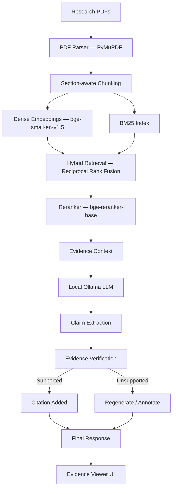
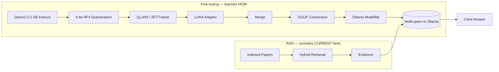

# BioLit — Domain-Finetuned, Evidence-Grounded Scientific Literature Synthesis

A **local, privacy-preserving** research assistant for biomedical / drug-discovery literature. Every model — embeddings, reranker, generator, verifier — runs on your machine through [Ollama](https://ollama.com) and local Hugging Face models. No document, query, or answer ever leaves the machine. There is no OpenAI/Anthropic/Gemini call anywhere in this codebase.

BioLit is not a chatbot. It is a hybrid-retrieval RAG pipeline with claim-level citation verification, a QLoRA fine-tuning pipeline that specializes a small open model for biomedical literature analysis, and an evaluation framework that measures — rather than assumes — whether any of that actually helps.

---

## Status and results at a glance

**Works today (verified):** an end-to-end local pipeline over 6 arXiv papers (123 indexed chunks) — ingest, hybrid retrieval, rerank, cited answer, claim verification, React UI. `GET /api/health` reports `ok`, and the model-free test suite passes (84 tests; the API and retrieval tests additionally load models). The app serves `qwen2.5:3b` through Ollama.

**Measured** on 14 held-out prompts (6 validation + 8 test; details and caveats in [§11](#11-evaluation)):

| Configuration | Cites `[n]` | Passes citation checks | Sentences cited |
|---|---|---|---|
| Base Qwen2.5-1.5B | 0 / 14 | 0 / 14 | 0% |
| Fine-tuned 1.5B, v1 (66 training examples) | 14 / 14 | 7 / 14 | 68% |
| Fine-tuned 1.5B, v2 (115 examples, half-trained) | 13 / 14 | 7 / 14 | 79% |
| `qwen2.5:3b` as served | 12 / 14 | 0 / 14 | 43% |
| `qwen2.5:3b` + citation-style prompt (no training) | 14 / 14 | 9 / 14 | 94% |

**Takeaway, honestly stated:** fine-tuning fixed the small model's citing (0 → 14 of 14), but a better prompt on the larger served model did about as well with no training at all. So the app takes the prompt route, and the fine-tuned adapters are **not deployed**. The sample is small, and the checks measure citation form and grounding, not factual correctness.

---

## 1. Project overview

Given a folder of biomedical PDFs, BioLit:

1. Parses them into page- and section-aware chunks (PyMuPDF).
2. Indexes those chunks with both dense embeddings (FAISS) and lexical search (BM25).
3. Retrieves and reranks evidence for a research question in one of three configurable modes (Fast / Balanced / High-Faithfulness).
4. Generates an answer through a local Ollama model, with every factual sentence numbered against its source evidence.
5. Extracts the claims the model made, re-checks each one against its cited evidence with a second LLM pass, and labels it `SUPPORTED` / `PARTIALLY_SUPPORTED` / `UNSUPPORTED` / `CONTRADICTED`.
6. Surfaces all of this — answer, citations, evidence text, page numbers, verification status, latency — in a React evidence-viewer UI.
7. Optionally fine-tunes a small Qwen2.5-Instruct model with QLoRA specifically on the analysis *behavior* (summarizing, comparing, spotting limitations/gaps) this system needs, and (optionally) deploys the result back into Ollama. The training, evaluation and export code is implemented; the adapters trained so far are evaluated but not deployed (see Results).

## 2. Motivation

Generic chatbots over PDFs tend to (a) blend retrieval and generation into one opaque step, (b) trust the model's own citations, and (c) have no way to tell you whether a claim is actually supported. For biomedical literature — where a wrong "32% reduction in tumor growth" is not a cosmetic bug — that's not good enough. BioLit keeps retrieval, generation, and verification as separate, inspectable stages, and reports honestly when something wasn't checked or couldn't be confirmed.

## 3. Architecture





The export/deployment branch of the second diagram is implemented (`training/export.py`, `scripts/setup_ollama.py`) but has **not been run** for the adapters trained so far; the app currently serves `qwen2.5:3b`.

Fine-tuning and RAG are deliberately kept separate responsibilities (see [§21 Design principle](#21-design-principle)): fine-tuning changes *how* the model analyzes literature; RAG supplies *what* it knows about, at query time, from your actual corpus.

## 4. Why fine-tuning?

An off-the-shelf instruct model can follow "summarize this" but has no particular discipline around citation hygiene, distinguishing supported claims from interpretation, or biomedical-specific structures like methodology/results/limitations decomposition. QLoRA fine-tuning on a curated instruction set (built from your own indexed papers' evidence, never fabricated) teaches that *behavior*, cheaply, on a single consumer GPU — without ever baking specific paper facts into model weights, which would go stale and can't be cited.

**What the measurements showed.** Fine-tuning did teach the citation behavior — the base 1.5B model cited on 0 of 14 held-out prompts, the fine-tuned adapters on 13–14. But adding the same citation rules to the *prompt* of the larger served model reached similar or better results without any training, so fine-tuning is not what the deployed app relies on. It remains useful as an experiment in how much behavior a few dozen examples can teach a small model. See [§11](#11-evaluation).

## 5. Why RAG?

Facts belong in the index, not the weights. RAG is what lets BioLit answer questions about papers added five minutes ago, cite a specific page, and be updated by dropping in a new PDF — none of which fine-tuning alone can do.

## 6. Why Ollama?

Ollama is the only LLM inference path in this application. It keeps the served model, the runtime, and all inference fully local and swappable (GGUF in, `ollama create`, done) without the app depending on any cloud provider's API or uptime.

## 7. Repository layout

```
BioLit/
├── backend/            FastAPI app: ingestion, retrieval, generation, verification, evaluation
├── frontend/            React + TypeScript + plain CSS UI (no Tailwind, no component libs)
├── training/             QLoRA dataset build / train / evaluate / export (LoRA -> GGUF -> Ollama)
├── data/                 raw PDFs, processed papers, train/val/test splits, indexes, results (gitignored)
├── models/               LoRA adapters, merged model, GGUF export (gitignored)
├── experiments/          evaluation results (the citation-evaluation JSONs are committed; the rest is gitignored)
├── scripts/              CLI entry points (see §14)
├── configs/               models.yaml, retrieval.yaml, training.yaml — the only place to change models/params
└── tests/                 cross-cutting + integration tests (per-package tests live under backend/tests)
```

## 8. Dataset

Training examples are built **from your own indexed papers** (`data/processed/*.json`) — never from hard-coded biomedical facts — and split at the **paper level**, so no paper's text appears in more than one of train / val / test (retrieval for a split's examples is restricted to that split's papers).

**`training/build_cited_dataset.py`** (used for every reported run) produces examples in the exact format the RAG pipeline uses at inference: the pipeline's own system prompt, a user prompt with numbered evidence blocks, and an answer that cites those blocks with `[n]`.

1. **Questions.** A local Ollama model writes questions from real passages (each with a different focus: a result, a mechanism, or a reason/comparison), plus templated summarize, limitations and comparison tasks.
2. **Evidence.** The real retriever and reranker run for each question; 5, 4 or 3 evidence blocks are used, whichever fits the token budget.
3. **Answer.** A local Ollama "teacher" (`qwen2.5:3b`; no cloud model is ever called) drafts the answer. A short style hint is appended to the system prompt **at generation time only**, so the stored example keeps the plain pipeline prompt and the fine-tuned model learns the style from the prompt it will actually receive.
4. **Filtering.** An answer is kept only if it passes deterministic checks: every `[n]` refers to a real evidence block; most sentences are cited; numbers appear in the cited evidence, near matching words; each cited block is individually relevant to its sentence; wording is grounded in the cited evidence; and the answer is not filler or a restatement of the question. Everything else is logged with its rejection reason (`data/training/cited_attempts.jsonl`).

About 30% of candidates survive (129 of 417). The final set is **115 train / 6 validation / 8 test** examples, almost all single-paper question answering. The teacher failed the checks on comparison, synthesis and research-gap tasks, so those task types are **not represented** — a real gap.

The data is generated locally and not committed (it is derived from third-party papers). The checks are heuristics, not proof of correctness: skim a sample of `data/training/train.jsonl` before trusting it.

`training/prepare_dataset.py` (the original builder) is kept for reference. It was superseded because it fed whole papers as context — 3k–32k tokens against a 2048-token training limit, so every response was truncated away — and it deliberately excluded `[n]` citations, so it could not teach the behavior the pipeline needs. `training/train.py` now drops over-length examples and reports how many, instead of truncating silently.

## 9. Retrieval pipeline

- **Chunking**: page-aware, section-tagged (Abstract/Introduction/Methods/Results/Discussion/Limitations/Conclusion/References), sentence-boundary-respecting, configurable size/overlap (`configs/retrieval.yaml`).
- **Dense**: `BAAI/bge-small-en-v1.5` embeddings in a FAISS flat inner-product (cosine) index.
- **Lexical**: BM25 (`rank_bm25`) over the same chunks.
- **Fusion**: Reciprocal Rank Fusion combines dense + BM25 rankings.
- **Reranking**: `BAAI/bge-reranker-base` cross-encoder re-scores the fused top candidates down to the final evidence set.
- **Three modes** (`configs/retrieval.yaml` → `modes`), selectable per query in the UI:
  - **Fast** — dense retrieval only, no reranker, no verification. Lowest latency.
  - **Balanced** — hybrid (dense+BM25) retrieval + reranker, citations extracted but not LLM-verified.
  - **High-Faithfulness** — hybrid + reranker + lightweight query decomposition + full claim extraction, LLM-based verification, and regeneration of unsupported claims (or explicit "unsupported" annotation if regeneration still fails).

## 10. Citation verification

After generation, every factual statement is extracted as a claim and mapped to its `[n]` marker(s). The extractor deliberately ignores scaffolding that is not an assertion — headings, lead-ins ("The main findings are:"), bare citation markers, label-only lines, an uncited "the evidence does not specify X" caveat, and any echo of the regeneration prompt — and it keeps a citation with the sentence it belongs to even when the model places it after the period or on the next line. Each cited claim is independently re-checked against *only* its cited evidence by a second, low-temperature LLM pass and classified `SUPPORTED` / `PARTIALLY_SUPPORTED` / `UNSUPPORTED` / `CONTRADICTED`. Claims with no citation are never assumed supported.

In High-Faithfulness mode an unsupported answer is regenerated, but a revision is kept only if it retains its citations and lowers the unsupported rate; otherwise the original answer is kept, with its unverified claims annotated. (A small model often "revises" by dropping every `[n]`, which would leave the answer unverifiable.)

The verifier itself was checked on controlled cases and got 12 of 12 right: verbatim sentences came back `SUPPORTED`, and both invented claims and mis-cited claims came back `UNSUPPORTED`. In practice its rejections trace back to the generator — citing the wrong block, or citing nothing.

**Known gap:** Fast and Balanced modes do not verify, so their claims keep the default `UNSUPPORTED` status and the precision/faithfulness figures shown for them read 0%. That means "not verified", not "wrong"; a dedicated status is future work.

Citation Precision, Citation Coverage and Faithfulness are computed in `backend/app/verification/citation_validator.py`.

## 11. Evaluation

### Methodology
- **Citation behavior** (`training/eval_citations.py`, `training/eval_ollama_citations.py`, merged by `scripts/summarize_citation_evals.py`): every configuration answers the same 14 held-out prompts in the pipeline's exact prompt format and is scored by the same answer checker that built the training data (§8). The consolidated results are served at `GET /api/evaluation` and shown on the Evaluation page.
- **Retrieval** (Recall@k, MRR, nDCG): implemented in `backend/app/evaluation/retrieval_metrics.py` but **not measured** — it needs labelled relevance judgements this corpus does not have.
- **Latency** per RAG mode: `scripts/benchmark.py`. It has not been run against the final pipeline, so no latency figures are reported here. For orientation, single answers from the served model took roughly 4–20 s in Fast/Balanced mode (longer for summaries and comparisons) and 15–60 s in High-Faithfulness mode on the development laptop (RTX 3050, 4 GB).

### Results

| Configuration | Cites `[n]` | All ids valid | Passes checks | Val | Test | Sentences cited | Avg words |
|---|---|---|---|---|---|---|---|
| Base Qwen2.5-1.5B | 0/14 | 0/14 | 0/14 | 0/6 | 0/8 | 0% | 93 |
| Fine-tuned v1 (66 examples) | 14/14 | 14/14 | 7/14 | 4/6 | 3/8 | 68% | 42 |
| Fine-tuned v2 (115 examples, checkpoint 21 of 42) | 13/14 | 13/14 | 7/14 | 3/6 | 4/8 | 79% | 38 |
| `qwen2.5:3b` as served | 12/14 | 12/14 | 0/14 | 0/6 | 0/8 | 43% | 110 |
| `qwen2.5:3b` + style hint (prompt only) | 14/14 | 14/14 | 9/14 | 3/6 | 6/8 | 94% | 53 |

*Cites* = answers with at least one `[n]`. *Passes checks* = passes every check in §8. *Sentences cited* = average share of factual sentences carrying a marker. Raw results: `experiments/finetuned/citation_eval*.json`.

**What this shows.** Fine-tuning taught the small model to cite (0 → 13–14 of 14) and to cite most of its sentences. The served 3B usually includes some citation but rarely cites every claim, and it pads answers with filler that the checks reject. Adding citation rules to its prompt closed most of that gap with no training. On the summarize prompt, the unhinted 3B and v2 cited nothing; only v1 (and the hinted 3B) did.

**What it does not show.**
- **Correctness.** Nothing here measures whether an answer is factually right, only its citation form and wording-level grounding.
- **A significant difference between the adapters and the hinted 3B.** Seven versus nine passes out of 14 is within noise; the paired comparison is 5 vs 3 discordant examples.
- **Independence.** The checks favor models trained or prompted toward the style they reward. Validation prompts also chose the adapters' checkpoints, so the test column is the cleaner number.
- **Fair decoding.** The adapters were decoded greedily and the served model was sampled with the app's settings.
- **Final wording.** The app's prompts now carry the same citation rules without the hint's 1–5 sentence cap. I spot-checked them live (see below) but did not re-score all 14 prompts with the final wording.

**Live spot checks of the running app** (few questions, indicative only): the Balanced-mode question that originally produced an answer with no citations (18 claims, none cited) now gives 3 claims, all cited; summarize gives 88% of claims cited; a two-paper methodology comparison gives 55%. In High-Faithfulness mode, 1 of 3 questions was fully verified (faithfulness 75%, precision 100%); the other 2 were rejected because the model mis-cited or did not cite.

### Reproduce
```bash
python training/eval_citations.py --adapter_path models/adapters/biolit-qwen-lora \
       --extra_adapter v2=models/adapters/biolit-qwen-lora-v2/checkpoint-21 \
       --output experiments/finetuned/citation_eval_v1_v2.json
python training/eval_ollama_citations.py --models qwen2.5:3b                 # as served
python training/eval_ollama_citations.py --models qwen2.5:3b --style_hint \
       --output experiments/finetuned/citation_eval_ollama_hint.json          # prompt-only variant
python scripts/summarize_citation_evals.py                                    # -> citation_comparison.json
```

## 12. Installation

Requirements: Python 3.11+ (a compatible 3.12 works — used in development), Node.js 18+, [Ollama](https://ollama.com/download) installed and running, and for fine-tuning, an NVIDIA GPU with CUDA (4GB+ VRAM is enough for the default 1.5B QLoRA config; see `scripts/check_hardware.py`).

```bash
# Backend
python -m venv .venv
.venv\Scripts\activate            # Windows; use `source .venv/bin/activate` on macOS/Linux
pip install -r requirements-backend.txt
# add -r requirements-training.txt as well if you intend to fine-tune
# (one environment can hold both; the development venv does)

# Frontend
cd frontend
npm install
cd ..

cp .env.example .env
cp frontend/.env.example frontend/.env
```

`.env` is **not** loaded automatically: set `OLLAMA_MODEL` / `OLLAMA_HOST` as real environment variables, or edit `configs/models.yaml` (`ollama.serving_model_name` is the model the backend calls). `.env.example` documents the variables.

Torch is pinned generically in the requirements files — for GPU acceleration, install the CUDA-matched build from https://pytorch.org/get-started/locally/ **before** the rest of `requirements-backend.txt`/`requirements-training.txt`, or pip will happily give you a CPU-only wheel.

## 13. Running it end-to-end

```bash
# 0. Check what this machine can actually run
python scripts/check_hardware.py

# 1. Get the serving model into Ollama (configs/models.yaml -> ollama.serving_model_name)
ollama pull qwen2.5:3b

# 2. Ingest your own biomedical PDFs
#    (place PDFs in data/raw/ first — none are bundled with this repo)
python scripts/ingest.py --input data/raw --output data/processed

# 3. Build the retrieval indexes
python scripts/build_index.py

# 4. Start the backend
uvicorn backend.app.main:app --reload --port 8000

# 5. Start the frontend (separate terminal)
cd frontend && npm run dev
```

Open http://localhost:5173. The Dashboard reports Ollama/index health; Document Library is where you'd otherwise upload PDFs through the UI instead of the CLI ingestion above.

### Fine-tuning (optional, experimental)

```bash
python training/build_cited_dataset.py --train-questions-per-chunk 3   # resumable; about an hour on a laptop GPU
python training/train.py --config configs/training.yaml                # QLoRA; ~93 s per optimizer step on a 4 GB GPU
python training/eval_citations.py --adapter_path models/adapters/biolit-qwen-lora
python scripts/summarize_citation_evals.py                             # refresh the Evaluation page data

# Not run for the adapters trained so far (see Results):
python training/export.py                                              # merge LoRA -> GGUF (needs a local llama.cpp checkout)
python scripts/setup_ollama.py --mode finetuned
```

Training needs the whole GPU and roughly 3.5 GB of RAM: stop the backend and Ollama models first, and close other memory-hungry apps. See `training/README.md` for VRAM/OOM guidance.

### Benchmarking

```bash
python scripts/benchmark.py
```

Writes latency + citation-quality results per RAG mode to `data/results/` and `experiments/rag_modes/latest.json`, which then populate the Evaluation dashboard.

## 14. Command reference

| Command | Purpose |
|---|---|
| `python scripts/check_hardware.py` | GPU/VRAM/CUDA/RAM/disk detection + recommended config |
| `python scripts/ingest.py --input data/raw` | Parse + chunk PDFs into `data/processed/` |
| `python scripts/build_index.py` | Embed chunks, build FAISS + BM25 indexes |
| `python training/build_cited_dataset.py` | Build the citation-grounded SFT dataset (train/val/test, paper-level splits) |
| `python scripts/build_dataset.py` / `training/prepare_dataset.py` | Original whole-paper dataset builder (superseded, kept for reference) |
| `python training/train.py --config configs/training.yaml` | QLoRA fine-tuning |
| `python training/evaluate.py` | Eval-loss/perplexity + qualitative samples on the held-out test set |
| `python training/export.py` | Merge LoRA, convert to GGUF, write Ollama Modelfile |
| `python scripts/setup_ollama.py --mode {base,finetuned}` | Create the `biolit-qwen` Ollama model |
| `python training/eval_citations.py` | Score base model and LoRA adapters on held-out citation prompts |
| `python training/eval_ollama_citations.py` | Score an Ollama-served model on the same prompts (`--style_hint` for the prompt-only variant) |
| `python scripts/summarize_citation_evals.py` | Merge the raw results into `citation_comparison.json` for the UI |
| `python scripts/benchmark.py` | Fast/Balanced/High-Faithfulness latency + quality benchmark |

## 15. API

FastAPI backend at `http://localhost:8000`. Key endpoints (full schemas in `backend/app/models/schemas.py`):

| Method & Path | Purpose |
|---|---|
| `POST /api/documents/upload` | Upload a PDF |
| `GET /api/documents` | List documents + status |
| `DELETE /api/documents/{id}` | Remove a document and its index entries |
| `POST /api/documents/index` | Ingest + embed + index uploaded documents |
| `POST /api/query` | Ask a question (Fast/Balanced/High-Faithfulness) |
| `POST /api/compare` | Compare methodology/results/etc. across papers |
| `POST /api/literature-review` | Generate a clustered, cited literature review |
| `POST /api/verify` | Verify a single claim against given evidence |
| `GET /api/evaluation` | Citation-behavior comparison, plus retrieval/generation/latency metrics when measured, or "Not evaluated yet" |
| `GET /api/health` | Ollama availability, index sizes, degraded-mode reporting |

## 16. Screenshots

Not included yet. The corpus is local (the six papers are not bundled), so run the app per §13 and the Dashboard, Query and Evidence Viewer will show your own documents.

## 17. Limitations

- **Small evidence base.** Six papers, and held-out evaluation on 14 prompts from two of them. Differences of a few examples are noise, and retrieval quality is unmeasured.
- **Correctness is not measured.** The checks cover citation form and wording-level grounding, and they are biased toward the style the training data rewards. A human- or judge-scored sample is the missing piece.
- **The model still fails sometimes.** In High-Faithfulness mode it occasionally cites the wrong block or nothing at all; the verifier then correctly rejects those claims. Multi-paper comparisons are only about 55% cited.
- **No "not verified" status.** Fast and Balanced modes show 0% faithfulness because they do not verify, which reads as a bad score rather than "not measured".
- **The fine-tune is not deployed.** Adapters exist and are evaluated, but nothing has been exported to GGUF (it needs an external `llama.cpp` checkout), so the app serves `qwen2.5:3b`. The adapters were also trained with the earlier wording of the citation rules.
- **Training data covers only question answering.** The teacher model failed the checks on comparison, synthesis and research-gap tasks.
- **No OCR.** Scanned PDFs are detected and flagged (`scanned_needs_ocr`) rather than silently mis-parsed.
- **Query decomposition** in High-Faithfulness mode is a lightweight heuristic, not an agentic planner.
- **Hardware.** Developed on a 16 GB laptop with a 4 GB GPU. Memory pressure can kill long jobs, so close other apps when training or running High-Faithfulness queries.
- **No data ships with the repo.** Papers, indexes, datasets and adapters are generated locally.

## 18. Future work

- A dedicated "not verified" claim status, so unverified modes stop showing 0% faithfulness.
- Retry once with a reminder when a first answer contains no `[n]` markers.
- More papers, and a judged sample to measure correctness rather than citation form.
- Training examples for comparison, synthesis and research-gap tasks (needs a stronger teacher or a different generation method).
- Finish the second training run, export an adapter through `llama.cpp`, and benchmark it against the prompt-only 3B.
- Labelled relevance data for retrieval metrics; OCR for scanned PDFs; an agentic query planner.

---

## 21. Design principle

- **Fine-tuning** teaches the model *how* to analyze biomedical literature (structure, citation discipline, comparison/limitation/gap-finding skill).
- **RAG** supplies *what* the model knows about, at query time, from the papers you've actually indexed.
- **The citation system** connects generated claims to source passages.
- **The verifier** independently checks whether those claims are actually supported — it does not trust the generator's own citations.

Fine-tuning is never used as a substitute for retrieval, and retrieval is never asked to do what fine-tuning is for.
